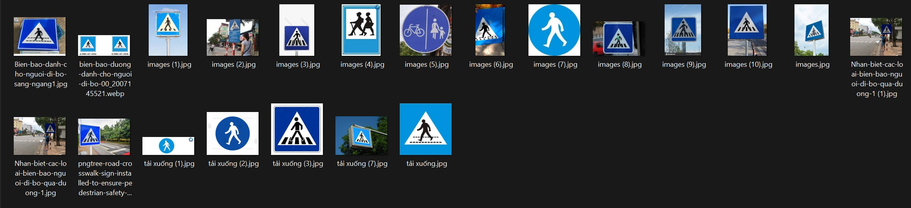
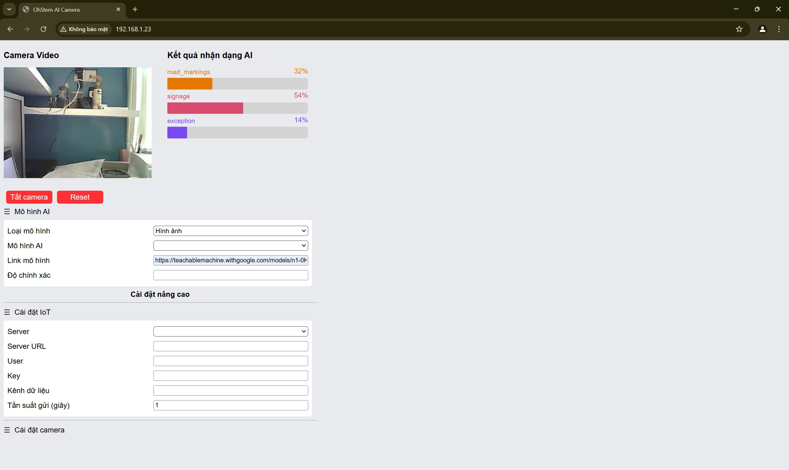
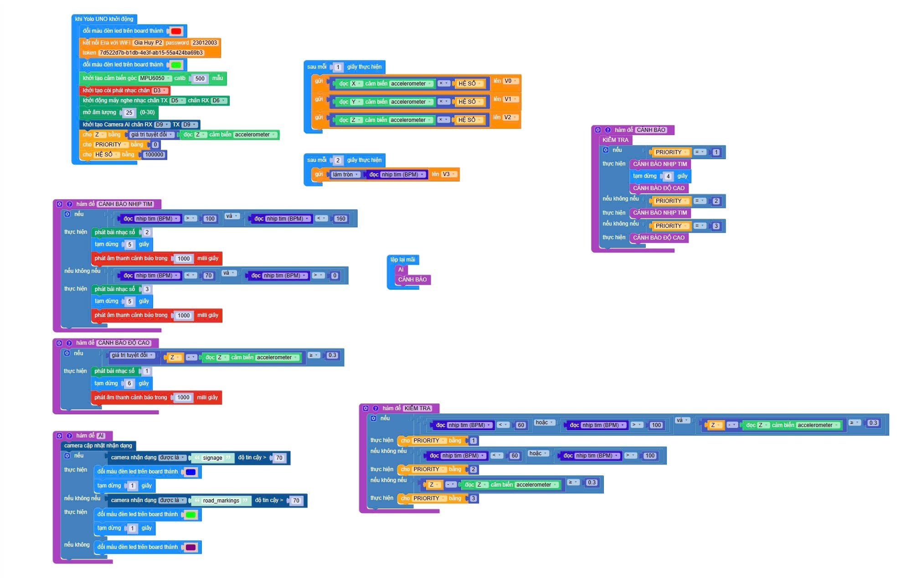
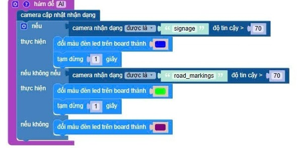
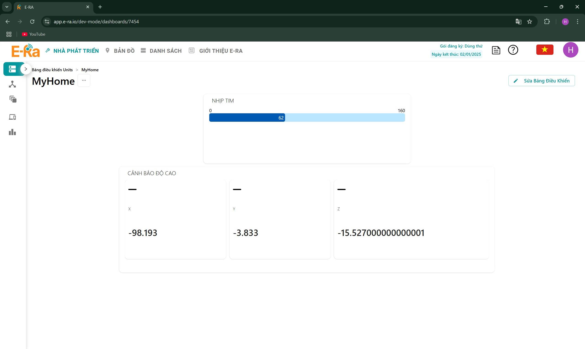
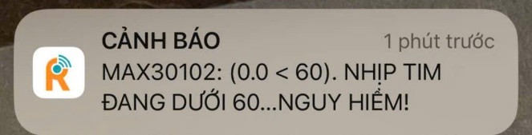
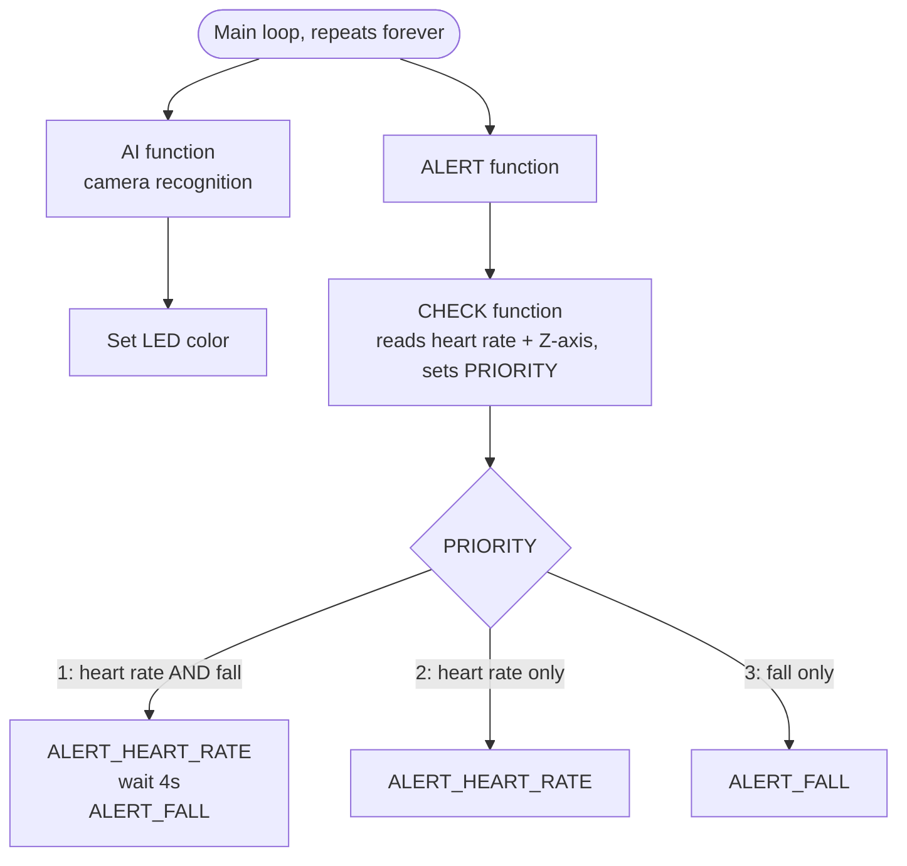
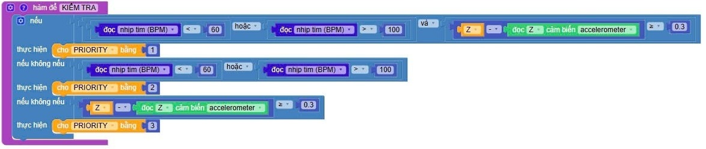
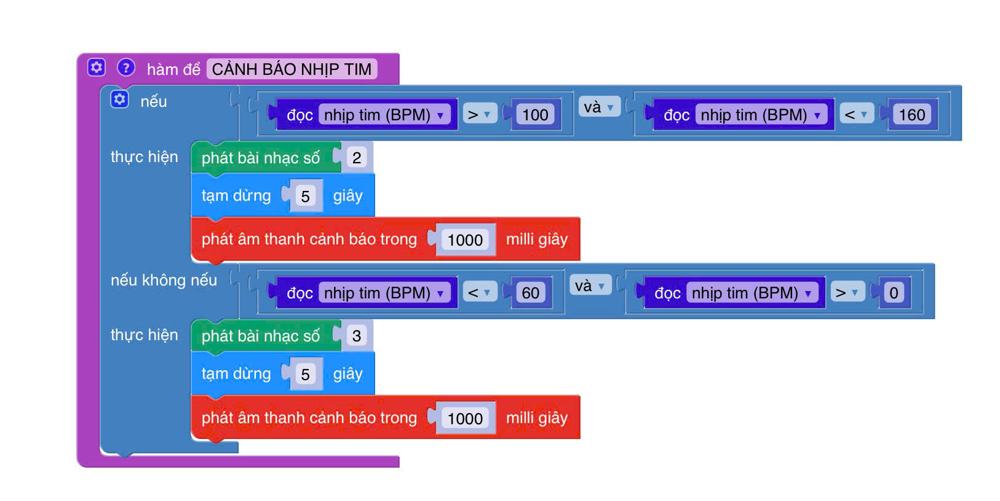
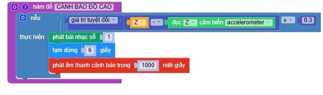

# Smart Health Cane (SHC)

**Award:** 3rd Prize, Can Tho City Science & Engineering Fair (KHKT), 2024-2025 school year

**Role:** Sole developer and main coder for the entire system (sensor integration, priority logic, AI camera integration, IoT alert dispatch). Concept design hand-sketched. Wiring and 3D printing assisted by [tên anh hỗ trợ, nếu muốn credit].

## Hardware

| Component | Function |
|---|---|
| Yolo:UNO | Main controller |
| MAX30102 | Heart rate + blood oxygen sensing |
| MPU6050 | Fall detection via Z-axis accelerometer deviation |
| Ultrasonic sensor | Obstacle detection, 3-200 cm range |
| Light sensor | Ambient light sensing → auto LED |
| AI Camera Kit V2 (OhStem) | Runs a Google Teachable Machine model for signage / crosswalk-marking recognition |
| Buzzer module | Audio alerts (3.3-5V, ~2.5 kHz) |
| Sound Player module | Plays recorded alert clips |
| E-Ra IoT Platform (WiFi) | Streams live heart rate + X/Y/Z accelerometer data to a web dashboard and mobile app; pushes fall/heart-rate alerts to a caregiver's phone in real time |

## System architecture

Sensors feed into the Yolo:UNO board as input; the board drives alerts and the IoT link as output.

```
   INPUT                                          OUTPUT
   ─────                                          ──────
   MAX30102 (heart rate)          ┌─────────────┐  Buzzer module
   MPU6050 (fall detection)  ───► │  Yolo:UNO   │► Sound Player module
   Ultrasonic sensor              │    board    │► E-Ra IoT Platform
   Light sensor                   └─────────────┘    (caregiver phone alert)
   AI Camera Kit V2
```

## AI training

Images were sorted into 3 labeled folders (one per recognition class) and trained using **Google Teachable Machine**, a no-code AI training tool. The resulting model runs on-device on the AI Camera Kit for real-time classification (crosswalk markings vs. pedestrian signage).

<p align="center">
  
  
</p>
<p align="center"><i>Training data: one labeled folder per class &nbsp;•&nbsp; live classification result on-device</i></p>

## How it was built

Programmed using the **OhStem App**, a block-based (drag-and-drop) visual programming environment for the Yolo:UNO board, conceptually similar to Scratch/Blockly. This project's logic (sensor init, priority ranking, alert dispatch, AI camera response) was designed and assembled block-by-block rather than typed as raw text code.

> Screenshots of the block program are below. This is the actual source, since the block editor doesn't export to a standalone text file.

<p align="center">
  
</p>

<p align="center">
  
</p>
<p align="center"><i>AI recognition function: classifies camera input as signage or road markings, sets LED color accordingly</i></p>

*Pseudocode below: a readable translation of the block logic above, not the literal source (the block editor has no text export).*

```
function AI():
    camera.update_recognition()
    if camera.detected == "signage" AND confidence > 70:
        set_LED(D10, BLUE)
        wait(1 second)
    elif camera.detected == "road_markings" AND confidence > 70:
        set_LED(D10, GREEN)
        wait(1 second)
    else:
        set_LED(D10, PURPLE)
```

## Live monitoring & alerts

Heart rate and fall-detection data stream to the E-Ra IoT dashboard in real time. When a fall or abnormal heart rate is confirmed, a push notification is sent directly to the caregiver's phone.

<p align="center">
  
</p>
<p align="center"><i>E-Ra dashboard: live heart rate and accelerometer (X/Y/Z) readout</i></p>

<p align="center">
  
  
</p>
<p align="center"><i>Real alert: abnormal heart rate &nbsp;•&nbsp; real alert: fall detected</i></p>

## Key design decisions

Every loop cycle runs two independent paths: the AI camera path (signage/road-marking recognition, immediate LED response) and the ALERT path, which first calls CHECK to assign PRIORITY, then dispatches based on it.



### 1. Handling simultaneous events: the "priority" variable
Multiple sensor events (abnormal heart rate, a fall) can trigger at once. Rather than letting alerts overwrite each other, a `PRIORITY` variable ranks which condition fires first: abnormal heart rate **and** a fall together (highest), heart rate alone, then a fall alone.

<p align="center">
  
</p>
<p align="center"><i>KIỂM TRA: assigns PRIORITY based on which sensor condition(s) are true</i></p>

<p align="center">
  
</p>
<p align="center"><i>CẢNH BÁO: dispatches the alert based on PRIORITY</i></p>

*Pseudocode below: a readable translation of the block logic above, not the literal source (the block editor has no text export).*

```
function ALERT():
    CHECK()
    if PRIORITY == 1:
        alert_heart_rate()
        wait(4 seconds)
        alert_fall()
    elif PRIORITY == 2:
        alert_heart_rate()
    elif PRIORITY == 3:
        alert_fall()

function CHECK():
    if (heart_rate < 60 OR heart_rate > 100) AND abs(Z_baseline - Z_now) >= 0.3:
        PRIORITY = 1   # both conditions, most critical
    elif heart_rate < 60 OR heart_rate > 100:
        PRIORITY = 2   # abnormal heart rate only
    elif abs(Z_baseline - Z_now) >= 0.3:
        PRIORITY = 3   # fall only
```

### 2. Fixing a false-positive assumption
The two functions below detect a fall and an out-of-threshold heart rate. Initial version treated "cane drops" as equivalent to "user falls" (using accelerometer Z-axis deviation alone as the fall trigger). A feedback question, *"what if only the cane falls, not the person?"*, exposed the flawed assumption.

Current implementation still triggers on Z-axis deviation ≥ 0.3, but a fall alert is deliberately staged **after** the heart-rate check (see `PRIORITY == 1` path above, a 4-second pause between the two alerts) so an abnormal heart rate reading, if present, gets flagged and cross-referenced rather than the fall alert firing in isolation.

<p align="center">
  
</p>
<p align="center"><i>CẢNH BÁO NHỊP TIM: heart-rate alert function</i></p>

<p align="center">
  
</p>
<p align="center"><i>CẢNH BÁO ĐỘ CAO: fall-detection alert function</i></p>

*Pseudocode below: a readable translation of the block logic above, not literal source.*

```
function ALERT_HEART_RATE():
    if 100 < heart_rate < 160:
        play_sound(track=2); wait(5s); play_alert_tone(1000ms)
    elif 0 < heart_rate < 60:
        play_sound(track=3); wait(5s); play_alert_tone(1000ms)

function ALERT_FALL():
    if abs(Z_baseline - Z_now) >= 0.3:
        play_sound(track=1); wait(6s); play_alert_tone(1000ms)
```

## Future development

A judge at the science fair asked what happens if the cane drops but the user does not, exposing a false-alarm risk in relying on a single fall-detection event. Planned fix: a two-step verification, a physical confirm button on the cane after a potential fall is detected, with an automatic caregiver alert if no confirmation arrives within a set window.

Other planned improvements: a lighter, more ergonomic casing for daily use, and replacing the current Teachable Machine model with a more robust embedded computer vision model for wider real-world reliability.

